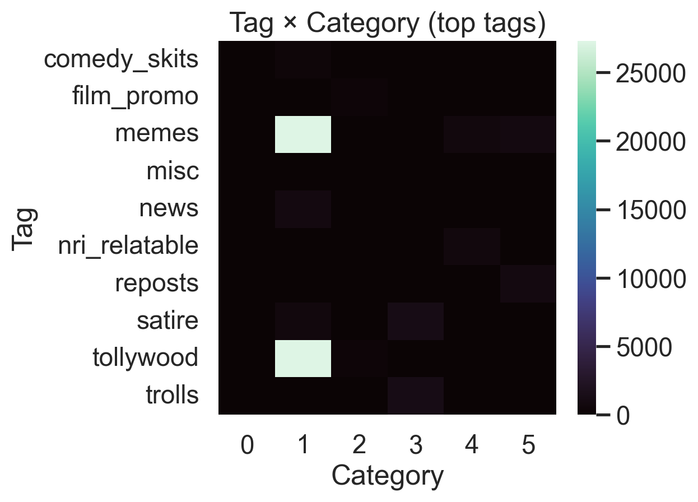

# 📊 Shadow Insta Analysis

This project analyzes Instagram activity and builds an **end-to-end ML + visualization pipeline**.  
It clusters your Instagram interactions, predicts future “vibes,” and produces **rich visual reports**.

---

## 📂 Project Structure
- `auto_suggest_tags.py` → Suggests relevant hashtags  
- `build_reels_log.py` → Builds engagement log  
- `multi_label_tagger.py` → Multi-label classification for tags  
- `train_shadow_insta.py` → Model training & evaluation  
- `report_v2/figs/` → Graph outputs (36+ visualizations)  

---

## 📈 Analysis Graphs

### 🔹 Core Trends
| Category Histogram | Rows per Day | Category Share (Monthly) |
|--------------------|--------------|---------------------------|
|  |  |  |

| Activity Heatmap | Top Accounts | Top Hashtags |
|------------------|--------------|--------------|
|  |  |  |

---

### 🔹 Sequence Dynamics
| Markov Heatmap | Markov Rank Lines |
|----------------|-------------------|
|  |  |

---

### 🔹 Tags & Categories
| Tag Frequency | Tag–Category Heatmap | Tag Share Over Time |
|---------------|----------------------|----------------------|
|  |  |  |

| Tag Co-Occurrence |
|-------------------|
|  |

---

### 🔹 Accounts by Cluster
| Cat 0 | Cat 1 | Cat 2 |
|-------|-------|-------|
|  |  |  |

| Cat 3 | Cat 4 | Cat 5 |
|-------|-------|-------|
|  |  |  |

---

### 🔹 Feature Importance (Negative Correlations)
| Cat 0 | Cat 1 | Cat 2 |
|-------|-------|-------|
|  |  |  |

| Cat 3 | Cat 4 | Cat 5 |
|-------|-------|-------|
|  |  |  |

---

### 🔹 Feature Importance (Positive Correlations)
| Cat 0 | Cat 1 | Cat 2 |
|-------|-------|-------|
|  |  |  |

| Cat 3 | Cat 4 | Cat 5 |
|-------|-------|-------|
|  |  |  |

---

### 🔹 Hourly Activity by Category
| Cat 0 | Cat 1 | Cat 2 |
|-------|-------|-------|
|  |  |  |

| Cat 3 | Cat 4 | Cat 5 |
|-------|-------|-------|
|  |  |  |

---

## 🚀 How to Run

```bash
# Clone this repo
git clone https://github.com/Kalyankaparaju/shadow-insta-analysis.git

# Navigate inside
cd shadow-insta-analysis

# Run training (example)
python train_shadow_insta.py
